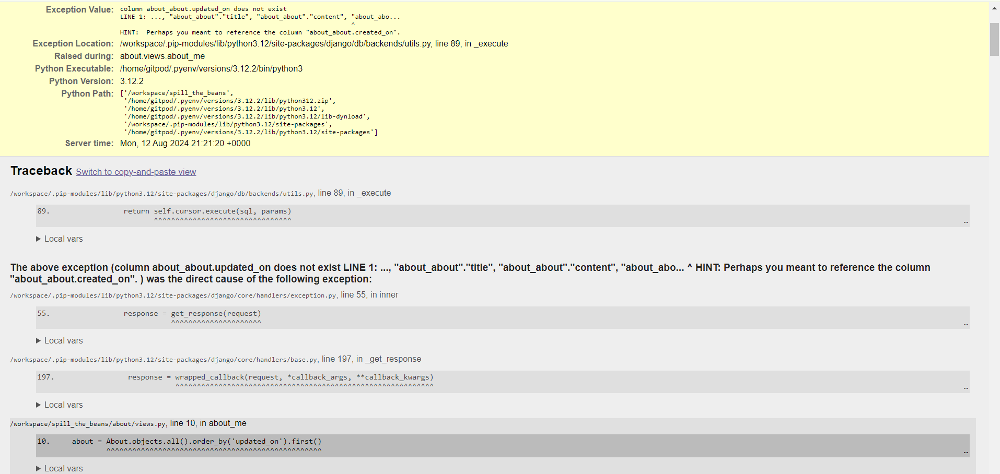

# Spill The Beans - Testing

Visit the deployed site: [Spill The Beans](//ENTER_DEPLOYED_SITE_HERE)

---

## Responsive Testing

## Broswer Compatibility Testing

## Bugs Resolved & Unresolved

| # | Bug | Troubleshooting Attempts | How I solved the issue | Screenshots |
| --- | --- | --- | --- | --- |
| 1 | About app not loading in server: Server Error (500) | - Ensure all file & directory paths are laid out correctly   - Compare steps taken with that of the lesson module   - Use diffchecker to compare snippets of code   - Delete About app & start process again   - Consult Google   - Consult tutor support | - Create a new database(db)   - Update env.py with new db   - Ensure all migrations were applied   - Delete old db from db manager   - Run command 'python3 manage.py loaddata db.json' in terminal |   |

## Lighthouse Testing Outcomes

## Code Validation

## User Stories Testing

## Features Testing