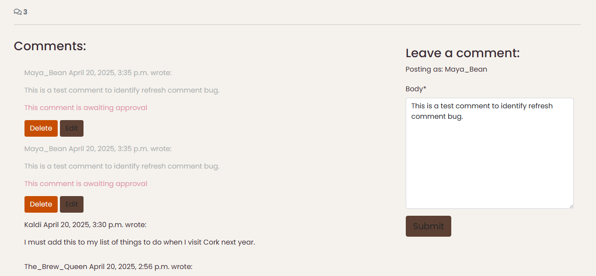
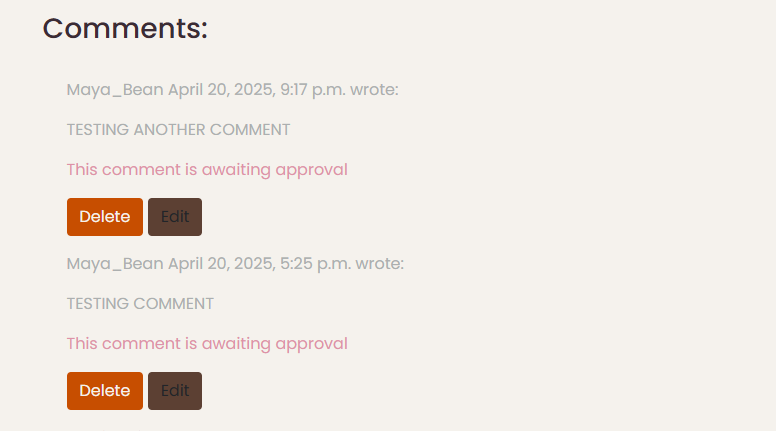
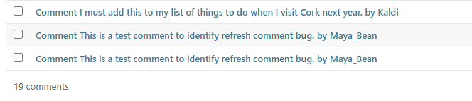
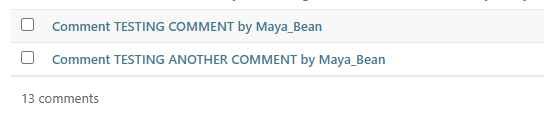
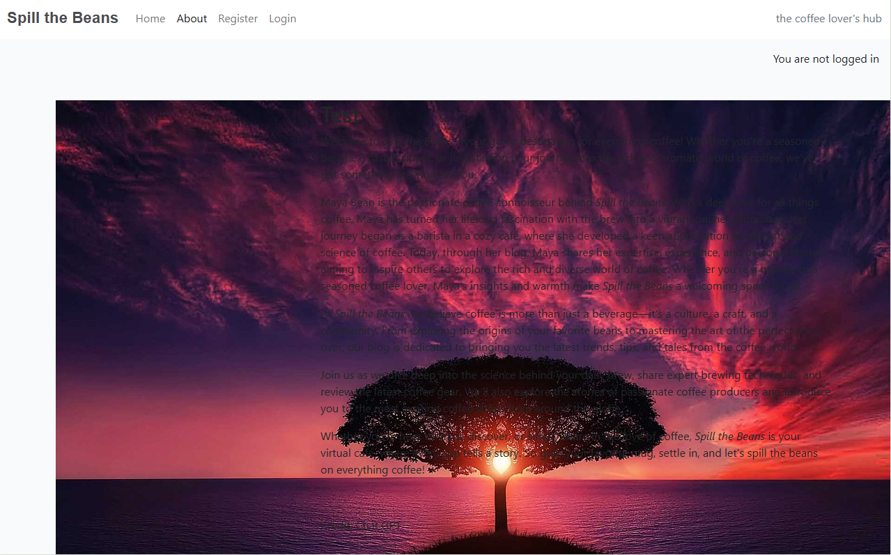
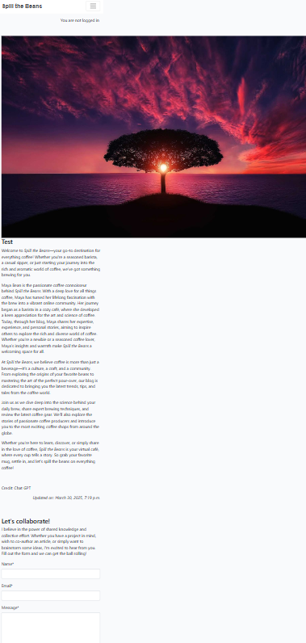
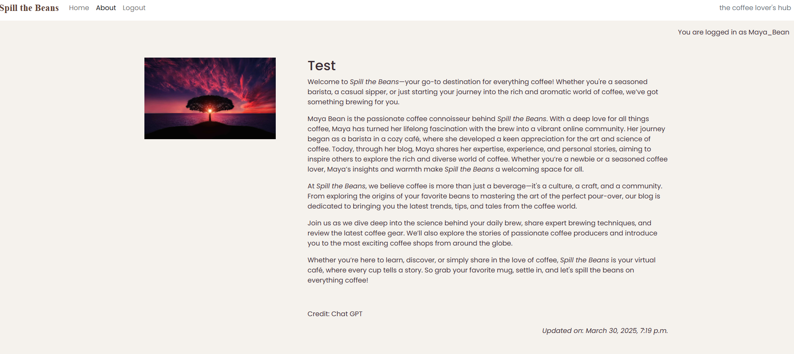
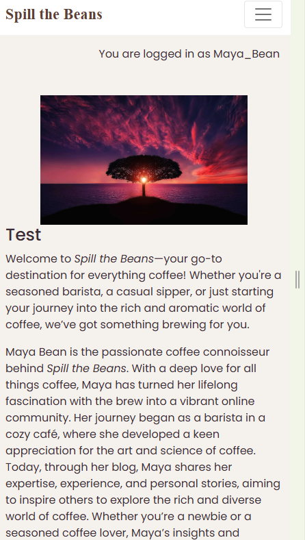
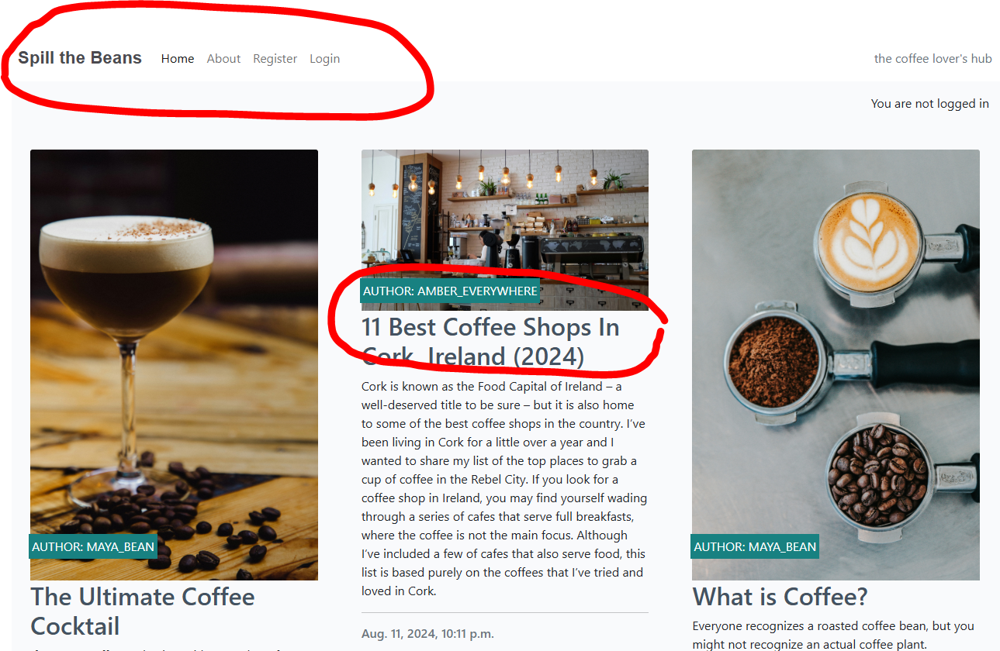
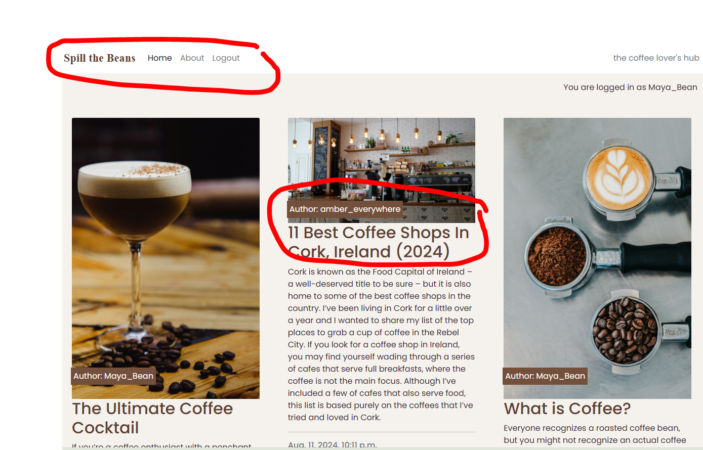

+# Spill The Beans - Testing

Visit the deployed site: [Spill The Beans](https://spill-the-beans-coffee-blog-8f04f8c6207f.herokuapp.com/)

---

All outlined testing was done upon completion of this project. Please see Bugs for any documented errors that occured while the build was in progress.

## Validation Testing

<details>
  <summary>Result Key</summary>
  <table>
    <thead>
      <tr>
        <th>Key</th>
        <th>Status</th>
      </tr>
    </thead>
    <tbody>
      <tr>
        <td>:heavy_check_mark:</td>
        <td>Pass</td>
      </tr>
      <tr>
        <td>:x:</td>
        <td>Fail</td>
      </tr>
      <tr>
        <td>:grey_exclamation:</td>
        <td>Minor Error</td>
      </tr>
    </tbody>
  </table>
  </details>


### HTML

[W3C](https://validator.w3.org/) was used to validate the HTML on all pages of the site. I chose to directly input the html code for each related page into the validator.

| Page | Status | Evidence |
| :--- | :---: | :---: |
| Home |   | [Home Page Validation](documentation/testing/validation/html/home.png) |
| About |   | [About Page Validation](documentation/testing/validation/html/about.png) |
| Register |   | [Register Page Validation](documentation/testing/validation/html/register.png) |
| Login |   | [Login Page Validation](documentation/testing/validation/html/login.png) |
| Terms of Use |   | [Custom Page Validation](documentation/testing/validation/html/terms-of-use.png) |


### CSS

[W3C](https://jigsaw.w3.org/css-validator/) was used to validate the CSS. The script was tested by direct input.

| Filepath | Status | Evidence |
| :--- | :---: | :---: |
| static/base.css | | [static/base.css validation](documentation/testing/validation/css/w3c-css-validation.PNG)  |


### JavaScript

[JS Hint](https://jshint.com/) was used to validate the JavaScript.

| File | Result | Evidence |
| :--- | :---: | :---: |
| static/js/comments.js | Pass | [comments.js](documentation/testing/validation/js/comments.PNG)  |


### Python

[Code Institute Python Linter](https://pep8ci.herokuapp.com/) was used to validate the python.

| File | Result | Evidence |
| :--- | :---: | :---: |
| **COFFEE** |
| coffee/settings.py |  | [settings.py validation](documentation/testing/validation/python/coffee_settings.PNG) |
| coffee/urls.py |  | [urls.py validation](documentation/testing/validation/python/coffee_urls.PNG) |
| **BLOG** |
| blog/admin.py |  | [apps.py validation](documentation/testing/validation/python/blog_admin.PNG) |
| blog/apps.py |  | [apps.py validation](documentation/testing/validation/python/blog_apps.PNG) |
| blog/forms.py |  | [forms.py validation](documentation/testing/validation/python/blog_forms.PNG) |
| blog/models.py |  | [models.py validation](documentation/testing/validation/python/blog_models.PNG) |
| blog/urls.py |  | [urls.py validation](documentation/testing/validation/python/blog_urls.PNG) |
| blog/views.py |  | [views.py validation](documentation/testing/validation/python/blog_views.PNG) |
| **ABOUT** |
| about/admin.py |  | [apps.py validation](documentation/testing/validation/python/about_admin.PNG) |
| about/apps.py |  | [apps.py validation](documentation/testing/validation/python/about_apps.PNG) |
| about/forms.py |  | [forms.py validation](documentation/testing/validation/python/about_forms.PNG) |
| about/models.py |  | [models.py validation](documentation/testing/validation/python/about_models.PNG) |
| about/urls.py |  | [urls.py validation](documentation/testing/validation/python/about_urls.PNG) |
| about/views.py |  | [views.py validation](documentation/testing/validation/python/about_views.PNG) |
| **TERMS** |
| terms/admin.py |  | [apps.py validation](documentation/testing/validation/python/terms_admin.PNG) |
| terms/apps.py |  | [apps.py validation](documentation/testing/validation/python/terms_apps.PNG) |
| terms/forms.py |  | [forms.py validation](documentation/testing/validation/python/termst_forms.PNG) |
| terms/models.py |  | [models.py validation](documentation/testing/validation/python/terms_models.PNG) |
| terms/urls.py |  | [urls.py validation](documentation/testing/validation/python/terms_urls.PNG) |
| terms/views.py |  | [views.py validation](documentation/testing/validation/python/terms_views.PNG) |


---


## Lighthouse Report

Google's Lightouse was used to test the performance, accessibility, best practices ad SEO of the site. In order to adhere to best practices, these tests were performed in an incognito window.


### Desktop Results

| Page | Result |
| :--- | :--- |
| Home Page |  |
| Products Page |  |
| Product Details Page |  |
| Add Product Page |  |
| Edit Product Page |  |
| Bag Page |  |
| Checkout Page |  |
| Checkout Success Page |  |
| Profile Page |  |
| Contact Us Page |  |
| Privacy Policy Page|  |
| Terms & Conditions Page |  |
| Delivery Policy Page |  |


### Mobile Results

| Page | Result |
| :--- | :--- |
| Home Page |  |
| Products Page |  |
| Product Details Page |  |
| Add Product Page |  |
| Edit Product Page |  |
| Bag Page |  |
| Checkout Page |  |
| Checkout Success Page |  |
| Profile Page |  |
| Contact Us Page |  |
| Privacy Policy Page|   |
| Terms & Conditions Page |  |
| Delivery Policy Page |  |


---


## Wave

WAVE(Web Accessibility Evaluation Tool) allows developers to create content that is more accessible to users with disabilities. It does this by identifying accessibility and WGAC errors.

| Page | Errors |
| :--- | :--- |
| Home Page | No errors|
| Profile Page |No errors. It is showing 1 low contrast warning, however I am unable to find where it is as the badge for the contract warning is not actually displaying on the page |
| Contact Us Page | No errors |
| Privacy Policy Page| No errors |
| Terms & Conditions Page | No errors |
| Delivery Policy Page | No errors |
| 404 Error Page | No errors |


---


## Manual Testing

### User Stories Testing

| User Story ID | As a/an | I want to be able to ... | So that I can... | How is this achieved? | Evidence |
| :--- | :--- | :--- | :---| :--- | :--- |
| 1 | Site User | view a paginated list of posts | select which post I want to view.  | Given more than one post in the database, these multiple posts are listed. These are organised into columns and rows so that the user can clearly see the blog posts available. | [Lg Screen Pagination](documentation/testing/user-stories/NAME_OF_IMG.png) <br> [Sm Screen Pagination](documentation/testing/user-stories/NAME_OF_IMG.png) |
| 2 | Site User | click on a post | read the full text. | When a user clicks on a blog post title, they are provided with a detailed view of the post.| [Blog Post Title](documentation/testing/user-stories/NAME_OF_IMG.png) |
| 3 | Site User/Admin | view comments on an individual post | read the conversation thread. | Given one or more user comments they can view them, and click on the comment thread to read the conversation. | [View Comments](documentation/testing/user-stories/NAME_OF_IMG.png) |
| 4 | Site User | register for an account | comment on a post.  | Given an email, a user can register an account, log in & comment on a blog post. | [Account Registration](documentation/testing/user-stories/NAME_OF_IMG.png) <br> [Login](documentation/testing/user-stories/NAME_OF_IMG.png) <br> [Comment as User](documentation/testing/user-stories/NAME_OF_IMG.png) |
| 5 | Site User | leave comments on a post | be involved in the conversation. | A user can leave a comment for review by admin. Once this is approved by admin, then a user can reply. Given more than one comment, the conversation becomes a thread. | [Comment](documentation/testing/user-stories/NAME_OF_IMG.png) <br> [Comment Approved](documentation/testing/user-stories/NAME_OF_IMG.png) <br> [Conversation becomes Thread](documentation/testing/user-stories/NAME_OF_IMG.png) |
| 6 | Site User | modify or delete my comment on a post | be involved in the conversation. | Given a logged in user, they can modify or delete their comment. | [Modify Comment](documentation/testing/user-stories/NAME_OF_IMG.png) <br> [Delete Comment](documentation/testing/user-stories/NAME_OF_IMG.png) |
| 7 | Site Admin | Create, Read, Update and Delete posts | manage my blog content. | Given a loggined in user, they can create, read, update or delete a blog post. | [Create Post](documentation/testing/user-stories/NAME_OF_IMG.png) <br> [Read Post](documentation/testing/user-stories/NAME_OF_IMG.png) <br> [Update Post](documentation/testing/user-stories/NAME_OF_IMG.png) <br> [Delete Post](documentation/testing/user-stories/NAME_OF_IMG.png) |
| 8 | Site Admin/User | create draft posts | finish writing the content later. | Given a logged in user, they can save a draft blog post & finish the content at a later time. | [Blog Post Draft](documentation/testing/user-stories/NAME_OF_IMG.png) |
| 9 | Site Admin | approve or disapprove of comments | filter out an objectionable comments. | Given a logged in site admin, they can approve or disapprove a comment for publication. | [Approve Comment](documentation/testing/user-stories/NAME_OF_IMG.png) <br> [Disapprove Comment](documentation/testing/user-stories/NAME_OF_IMG.png) |
| 10 | Site User | click on the About link | read more about the site. | Users are able to access the About page (visible from the navigation) when the link is clicked. | [About Page](documentation/testing/user-stories/NAME_OF_IMG.png) |
| 11 | Site Admin | create or update the About page content | it is available on the site. | The About app is visible in the admin panel & edits can be made to the About section with ease. | [About Admin Panel](documentation/testing/user-stories/NAME_OF_IMG.png) <br> [Edit About Content](documentation/testing/user-stories/NAME_OF_IMG.png) |
| 12 | Site Admin/User | see timestamps | know all entries are current. | All updates to the About page are timestamped. | [About Timestamp](documentation/testing/user-stories/NAME_OF_IMG.png) |
| 13 | Site User | easily understand what the blog is about | navigate the website with ease. | The website uses clear and descriptive titles; intuitive navigation; clean, readable font; consistent structure; unclutter imagery that reflects the topic; high contrast between backgrounds and text. | [Clear & Descriptive Titles](documentation/testing/user-stories/NAME_OF_IMG.png) <br> [Intuitive Navigation](documentation/testing/user-stories/NAME_OF_IMG.png) <br> [clean & Readable Font](documentation/testing/user-stories/NAME_OF_IMG.png) <br> [Consistent Structure](documentation/testing/user-stories/NAME_OF_IMG.png) <br> [Uncluttered Imagery](documentation/testing/user-stories/NAME_OF_IMG.png) <br> [High Contrast](documentation/testing/user-stories/NAME_OF_IMG.png) |
| 14 | Potential collaborator | fill in a contact form | submit a request for collaboration. | The site owner can be contacted when someone wishes to collaborate. | [Contact Form](documentation/testing/user-stories/NAME_OF_IMG.png) |
| 15 | Site Owner | store collaboration requests in the database | review them. | All collaboration requests submitted are stores in the database where they can be reviewed. | [Store & Review Collaboration Requests](documentation/testing/user-stories/NAME_OF_IMG.png) |
| 16 | Site Owner | mark collaboration requests as "read" | see how many I still need to process. | The site owner can see the progress made on collaboration requests at a glance, and can manage the processing of these requests. | [Collaboration Requests "Read"](documentation/testing/user-stories/NAME_OF_IMG.png) |


### Features Testing

| Feature | Expected Outcome | Testing Performed | Result | Pass/Fail |
| :--- | :--- | :--- | :--- | :--- |
| **NAVBAR** |
| Website Logo | Redirects to the assigned landing page. | Ensure another navbar tab is clicked. Click Logo. | Redirects correctly. |  |
| Home | Redirects user to Home page. | Ensure another navbar tab is clicked. Click Home tab. | Redirects correctly. |  |
| About | Redirects user to About page. | Ensure another navbar tab is clicked. Click About tab. | Redirects correctly. |  |
| Register | Redirects user to Registration page. | Ensure another navbar tab is clicked. Click Register tab. | Redirects correctly. |  |
| Login | Redirects user to Login page. | Ensure another navbar tab is clicked. Click Login tab. | Redirects correctly. |  |
| **Custom** | Redirects user to **Custom** page. | Ensure another navbar tab is clicked. Click **Custom** tab. | Redirects correctly. |  |
| Navbar Responsiveness | Navbar should be displayed using a hamburger menu toggle on smaller screens. | Checked the site on smaller screens. | Navbar is displayed using a hamburger menu toggle. |  |
||||||
| **FOOTER** |
| Social Media Icons | Open the social page in a new browser tab. | Clicked each icon. | Social page opened in a new browser tab. |  |
| Kate McGuane Link | Takes the user to my Github Profile in a new browser tab. | Clicked link. | Github profile opened in a new tab. |  |
| Footer Responsiveness | The footer sections should become stacked on smaller screens. | Looked at site on smaller screens. | Sections of footer became stacked. |  |
||||||
| **HOME (BLOG) PAGE** |||||
| Blog Posts | Click "Next" or "Prev" to move between blog post pages. | Click desired buttons. | The next page of blog posts are displayed. |  |
| | Click on blog post title to view the entire post. | Click blog post title. | Redirected to desired blog post. |  |
| | Can click on comments to view full thread (where applicable). | Click comments icon. |  |
| | Can login from bottom of blog post. | Click 'Login to leave a comment'. | Redirected to login page. |  |
||||||
| **ABOUT PAGE** |||||
| Collaboration Form | Form will not submit if required fields are not filled. | Click "Submit" without filling required fields. | Submission would not work unless all required fields were filled. |  |
| | Form is submitted when filled out & Submit button is clicked. | Fill out form & click "Submit". | Notified that form has been submitted. |  |
||||||
| **REGISTRATION PAGE** |||||
| Sign Up | Sign up to the website. | Filled out required fields & click "Sign Up". | Notified of successful registration to website upon completion of required fields. |  |
| | Refusal of registration if required fields not filled out. | Did not fill in all or some required fields. | Registration refused, & reminded of requirements in order to register. |  |
| | Refusal of registration if password criteria is not met. | Did not meet password criteria. | Registration refused, & reminded of password criteria in order to register. |  |
||||||
| **LOGIN PAGE** |||||
| Login to account | Upon successfully filling out all required fields, the user is signed in to their account. | Filled out required fields & clicked "Log In" button. | Login was successful. |
| Refused Login. | Left required fields empty or entered in the wrong information. | Login refused, & user is informed of what steps to take in order to rectify the issue. |  |
| Register account | User does not have an account and wishes to create one. | Clicked build in "Sign Up" link. | Redirected to registration page instead. |  |
||||||


**NOT_SURE_IF_I_WILL_TEST_ALL_OF_THESE_FEATURES_FOR_THIS_WEBSITE**

| **PROFILE PAGE** |||||
| Update default delivery information | Once the user has filled in the default delivery information they wish to store and clicked the update button, the information should be saved and be available in their profile and at checkout | Add default delivery information, save and then check the information displays in their profile and at checkout | Page reloads with the updated information pre-populated and a success toast is displayed to let the user know their profile was updated successfully | Pass |
| View previous orders made from my account | Users should be able to click on the first part of their order number in the order history section and be taken to the checkout success page for that order. A toast will also inform the user that they are viewing a previous order summary for the order number | Clicked on an order number | The checkout success page is displayed with the order summary and an alert toast is displayed letting the user know this is a past confirmation for the order number | Pass |
||||||
| **CONTACT US FORM** |||||
| Form Validation | If the user doesn't fill in the required fields and tries to submit the form, they will be shown a tooltip letting them know they need to fill in the required fields | Submit the form without filling in the required fields | Tooltip lets me know which fields I need to fill in | Pass |
| Send contact form | Once sent the user should be shown the contact page with a message thanking them for their enquiry and giving them a button to view the latest deals. A toast should also be displayed letting them know their enquiry was sent successfully | Fill in the contact form and clicked send. | Contact us page displays with thank you message and toast displayed letting me know enquiry was sent successfully. | Pass |
| **SUPERUSER OPTIONS**|||||
| Account icon Product management dropdown link | This links should only be displayed to a superuser. When clicked, the superuser will be taken to the add product page. If a regular user tries to manually view this page by using the url, they are not able to view the page and an error toast displays to let them know only administrators can perform that task. | Signed in as superuser and clicked the link. Signed in as a regular user and added the url into the address bar. | Link only shown to superuser. Superusers are taken to the add product page. Regular users are shown an error toast that informs them only administrators can perform that action. | Pass |
| Add Product Form Validation | The form will only be submitted and the new product created if the required fields have been filled in | Tried to submit the form without filling in all required fields | Tooltips let me know which fields need to still be filled in | Pass |
| New product created saved in the products section of the admin page | When a product is created, a record of it should also be displayed in the products section of the admin page | Create a new product, navigate to the admin products section | We can see the record created for the new product | Pass |
| Edit Product Link | This link should only be shown when logged in as a superuser. When the edit link is clicked (either on the products page or from the product detail page) superusers are taken to the edit product page. If a regular user tries to manually access the edit page using the url, they are given an error toast letting them know only administrators can perform that action | Clicked the Edit link as a superuser.  Logged in as regular user and manually enter the url into the address bar. | The edit link is only shown when logged in as a superuser. Superusers are shown the edit product page and regular users are shown an error toast letting them know that only administrators have permission to perform that action. | Pass |
| Delete Product Link | This link should only be shown to superusers. when clicked a superuser should be shown a modal asking them to confirm they would like to delete the product, and reminds them that this action cannot be undone. If a regular user tries to manually access this page using the url, they should be shown an error toast telling them they cannot perform the action. | Clicked the link as a superuser. Manually accessed the url as a regular user. | This link is only shown to superusers. The superuser is shown a modal that asks if they are sure they want to delete the product as this action cannot be undone. Regular users are shown an error toast letting them know that only administrators can perform that action | Pass |
| Contact form sent | All contact forms submitted to the site are stored in the contact form section of the admin page. It will display the name, email address, phone number (if filled in) and message, and will also detail the date of the contact along with a replied checkbox to enable the admin to keep track of whether they have responded | Open the admin page and navigate to the contact form section, select a contact email and view the information. | Information is displayed about the users name, email address, phone number (if entered), message sent and the date it was sent along with a checkbox for replied. | Pass |


---


## Responsiveness

The website was tested manually throughout the project development using DevTools to check for responsiveness.

The responsiveness was confirmed with [Responsive Website Design Tester](https://responsivedesignchecker.com/). The following are samples of some of the responsiveness implemented.


  ### Desktop Screens
  


  ### Tablet Screens
  


  ### Mobile Screens
  


---


## Broswer Compatibility

The website was tested on three different browsers: Brave, Chrome, & Microsoft Edge. It was compatable across all three.

The following elements were tested manually on each of the browsers:
  - Internal links work correctly, & as expected.
  - External links to socials work on the browsers listed & open a new tab for each corresponding link.
  - The contact form works correctly & displays the necessary response page on execution.


  ### Brave
  


  ### Chrome
  


  ### Microsoft Edge
  


---


## Bugs

### Resolved Bugs 

| # | Bug | Troubleshooting Attempts | How I solved the issue | Evidence |
| --- | --- | --- | --- | --- |
| 1 | About app not loading in server: Server Error (500) | - Ensure all file & directory paths are laid out correctly <br> - Compare steps taken with that of the lesson module <br> - Use diffchecker to compare snippets of code <br> - Delete About app & start process again <br> - Consult Google <br> - Consult tutor support | - Create a new database(db) <br> - Update env.py with new db <br> - Ensure all migrations were applied <br> - Delete old db from db manager <br> - Run command 'python3 manage.py loaddata db.json' in terminal |  |
| 2 | When a comment is submitted, it re-submits everytime the refresh button is clicked | Received tutor feedback | - The wrong attribute was being targeted in the editButton functionality <br> ``` let commentId = e.target.getAttribure("comment_id");``` <br> - I changed this to reflect the correct attribute <br> ``` let commentId = e.target.getAttribure("data-comment_id");``` <br> - The POST method in blog>views.py needed to be return a HTTP response & redirect so the comment could no longer be subjected to resubmission when the page was refreshed <br> ```return HTTP ResponseRedirect(reverse('post_detail', args=[slug]))``` |  <br>  |
| 3 | Bug #2 was fully responsive when logged in as admin | Resolved the issue as outlined in bug #2 | See bug #2 |  <br>  |
| 4 | Hero image on About page was filling the background & overlaying with the text | On revision of this project, this issue was only being rendered on the deployed version (images 1 & 2) & not visible when running the server during development (images 3 & 4) | See bug #5 for resolution |  <br>  <br>  <br>  |
| 5 | As per bug #4, many of the CSS features were not displaying as intended, nor were they the same as what was displaying when running the site from the server <br>  | - Investigated the dependencies, and needed to ensure they were being implemented correctly <br> - Ensured that ```DISABLE_COLLECTSTATIC:1``` was not in use on Heroku <br> - I discovered that the style.css from both the static directory and staticfiles directory were different <br> The staticfiles directory had not been updated with the changes made to static <br> - Ran ```python manage.py collectstatic``` in the terminal <br> style.css in staticfiles was now reflecting what was in the static directory, however it was not having the desired effect on the deployed version <br> - Cleared the cache - no changes <br> - Open Dev Tools &rarr; Right-click reload icon &rarr; "Empty Cache and Hard Reload" - no changes | - Ran ```rm -r staticfiles/*```followed by ```python manage.py collectstatic``` in the terminal <br> - Issue was resolved after this attempt when re-deployed; The deployed version was now reflecting the desired CSS |  <br>  |
| 6 | Change in `static/css/style.css` not reflecting when developing project (after set up of staticfiles with whitenoise) | - Refreshing the browser ``Ctrl + Shift + R`` <br> - ``Ctrl + F5`` for a hard refresh to clear the cache & fetch the latest version <br> - Applied "dummy" styling such as high contrast backgrounds to see if it would show up <br> - Consulted Google & ChatGPT | Similarly with bug #4 & #5, the command <br> ```python manage.py collectstatic``` <br> - Updated to the most recent, and desired styling <br> - Ultimately discovered that I had my DEBUG=False, which was preventing the update unless I manually ran the aforementioned command |  |

<br>

### Unresolved Bugs

There are no known bugs at this time.

| # | Bug | Troubleshooting Attempts | How I solved the issue | Evidence |
| --- | --- | --- | --- | --- |
