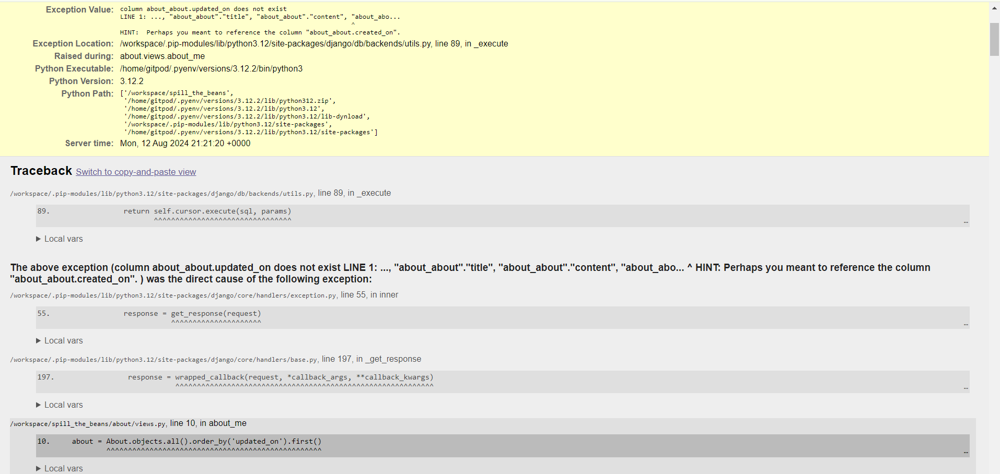

# Spill The Beans - Testing

Visit the deployed site: [Spill The Beans](https://spill-the-beans-coffee-blog-8f04f8c6207f.herokuapp.com/)

---

All outlined testing was done upon completion of this project. Please see Bugs for any documented errors that occured while the build was in progress.

## Validation Testing

Result Key

| Key | Status |
| :---: | :---: |
| :heavy_check_mark: | Pass |
| :x: | Fail |
| Minor Error | :grey_exclamation: |

### HTML

[W3C](https://validator.w3.org/) was used to validate the HTML on all pages of the site. I chose to directly input the html code for each related page into the validator.

| Page | Status | Evidence |
| :--- | :---: | :---: |
| Home |   | [Home Page Validation](ENTER_HTTP_HERE) |
| About |   | [About Page Validation](ENTER_HTTP_HERE) |
| Register |   | [Register Page Validation](ENTER_HTTP_HERE) |
| Login |   | [Login Page Validation](ENTER_HTTP_HERE) |
| 404 |   | [Home Page Validation](ENTER_HTTP_HERE) |
| *Custom* |   | [Custom Page Validation](ENTER_HTTP_HERE) |

### CSS

[W3C](https://validator.w3.org/) was used to validate the CSS.

| Filepath | Status | Evidence |
| :--- | :---: | :---: |
| static/base.css | | [static/base.css validation](ENTER_DOCUMENTATION_FILEPATH_HERE.PNG) |

### JavaScript

[JS Hint](https://jshint.com/) was used to validate the JavaScript.

| File | Result | Evidence |
| :--- | :---: | :---: |
| file/as/found/in/directory/filename.js | Pass | [filename.js](ENTER_DOCUMENTATION_FILEPATH_HERE.PNG) |
| file/as/found/in/directory/filename.js | Pass | [filename.js](ENTER_DOCUMENTATION_FILEPATH_HERE.PNG) |
| file/as/found/in/directory/filename.js | Pass | [filename.js](ENTER_DOCUMENTATION_FILEPATH_HERE.PNG) |

### Python

[Code Institute Python Linter](https://pep8ci.herokuapp.com/) was used to validate the python.

| File | Result | Evidence |
| :--- | :---: | :---: |
| custom_storages.py | Pass | [custom_storages.py validation](ENTER_DOCUMENTATION_FILEPATH_HERE.PNG) |
| **SEASIDE_SEWING** |
| seaside_sewing/settings.py | Pass | [settings.py validation](ENTER_DOCUMENTATION_FILEPATH_HERE.PNG) |
| seaside_sewing/urls.py | Pass | [urls.py validation](ENTER_DOCUMENTATION_FILEPATH_HERE.PNG) |
| **BAG** |
| bag/apps.py | Pass | [apps.py validation](ENTER_DOCUMENTATION_FILEPATH_HERE.PNG) |
| bag/contexts.py | Pass | [contexts.py validation](ENTER_DOCUMENTATION_FILEPATH_HERE.PNG) |
| bag/urls.py | Pass | [urls.py validation](ENTER_DOCUMENTATION_FILEPATH_HERE.PNG) |
| bag/views.py | Pass | [views.py validation](ENTER_DOCUMENTATION_FILEPATH_HERE.PNG) |
| bag/templatetags/bag_tools.py | Pass | [bag_tools.py validation](ENTER_DOCUMENTATION_FILEPATH_HERE.PNG) |
| bag/test_views.py | Pass | [test_views.py validation](ENTER_DOCUMENTATION_FILEPATH_HERE.PNG) |
| **CHECKOUT** |
| checkout/admin.py | Pass | [admin.py validation](ENTER_DOCUMENTATION_FILEPATH_HERE.PNG) |
| checkout/apps.py | Pass | [apps.py validation](ENTER_DOCUMENTATION_FILEPATH_HERE.PNG) |
| checkout/forms.py | Pass | [forms.py validation](ENTER_DOCUMENTATION_FILEPATH_HERE.PNG) |
| checkout/models.py | Pass | [models.py validation](ENTER_DOCUMENTATION_FILEPATH_HERE.PNG) |
| checkout/signals.py | Pass | [signals.py validation](ENTER_DOCUMENTATION_FILEPATH_HERE.PNG) |
| checkout/urls.py | Pass | [urls.py validation](ENTER_DOCUMENTATION_FILEPATH_HERE.PNG) |
| checkout/views.py | Pass | [views.py](ENTER_DOCUMENTATION_FILEPATH_HERE.PNG) |
| checkout/webhook_handler.py | Pass | [webhook_handler.py](ENTER_DOCUMENTATION_FILEPATH_HERE.PNG) |
| checkout/webhooks.py | Pass| [webhooks.py](ENTER_DOCUMENTATION_FILEPATH_HERE.PNG) |
| checkout/test_forms.py | Pass | [test_forms.py validation](ENTER_DOCUMENTATION_FILEPATH_HERE.PNG)|
| checkout/test_views.py | Pass | [test_views.py validation](ENTER_DOCUMENTATION_FILEPATH_HERE.PNG) |
| **HOME** |
| home/apps.py | Pass | [apps.py validation](ENTER_DOCUMENTATION_FILEPATH_HERE.PNG) |
| home/urls.py | Pass | [urls.py validation](documentation/testing/validation/python/home-urls-validation.png)|
| home/views.py | Pass | [views.py validation](documentation/testing/validation/python/home-views-validation.png) |
| home/test_views.py | Pass | [test_views.py validation](ENTER_DOCUMENTATION_FILEPATH_HERE.PNG) |
| **PRODUCTS** |
| products/admin.py | Pass | [admin.py validation](ENTER_DOCUMENTATION_FILEPATH_HERE.PNG) |
| products/apps.py | Pass | [apps.py validation](documentation/testing/validation/python/products-apps-validation.png) |
| products/forms.py | Pass | [forms.py validation](documentation/testing/validation/python/products-forms-validation.png) |
| products/models.py | Pass | [models.py validation](documentation/testing/validation/python/products-models-validation.png) |
| products/urls.py | Pass | [urls.py validation](documentation/testing/validation/python/products-urls-validation.png) |
| products/views.py | Pass | [views.py validation](documentation/testing/validation/python/products-views-validation.png) |
| products/widgets.py | Pass | [widgets.py validation](documentation/testing/validation/python/products-widgets-validation.png) |
| products/test_models.py | Pass | [test_models.py validation](documentation/testing/validation/python/products-test-models.png) |
| products/test_views.py | Pass | [test_views.py](ENTER_DOCUMENTATION_FILEPATH_HERE.PNG) |
| **PROFILES** |
| profiles/apps.py | Pass | [apps.py validation](ENTER_DOCUMENTATION_FILEPATH_HERE.PNG) |
| profiles/forms.py | Pass | [forms.py validation](documentation/testing/validation/python/profiles-forms-validation.png) |
| profiles/models.py | Pass | [models.py validation](documentation/testing/validation/python/profiles-models-validation.png) |
| profiles/urls.py | Pass | [urls.py validation](documentation/testing/validation/python/profiles-urls-validation.png) |
| profiles/views.py | Pass | [views.py validation](documentation/testing/validation/python/profiles-views-validation.png) |
| profiles/test_views.py | Pass | [test_views.py validation](documentation/testing/validation/python/profiles-test-views.png) |
| profiles/test_models.py | Pass | [test_models.py validation](ENTER_DOCUMENTATION_FILEPATH_HERE.PNG) |
| **CONTACT** |
| contact/admin.py | Pass |[admin.py validation](ENTER_DOCUMENTATION_FILEPATH_HERE.PNG) |
| contact/apps.py | Pass | [apps.py validation](documentation/testing/validation/python/contact-apps-validation.png) |
| contact/forms.py | Pass | [forms.py validation](documentation/testing/validation/python/contact-forms-validation.png) |
| contact/models.py | Pass | [models.py validation](documentation/testing/validation/python/contact-models-validation.png) |
| contact/urls.py | Pass | [urls.py validation](documentation/testing/validation/python/contact-urls-validation.png) |
| contact/views.py | Pass | [views.py validation](documentation/testing/validation/python/contact-views-validation.png) |
| contact/test_forms.py | Pass | [test_forms.py validation](documentation/testing/validation/python/contact-test-forms-validation.png) |
| contact/test_models.py | Pass | [test_models.py validation](documentation/testing/validation/python/contact-test-models.png)|
| contact/test_views.py | Pass | [test_views.py validation](ENTER_DOCUMENTATION_FILEPATH_HERE.PNG) |

---

## Lighthouse Report

Google's Lightouse was used to test the performance, accessibility, best practices ad SEO of the site.

### Desktop Results

| Page | Result |
| :--- | :--- |
| Home Page |  |
| Products Page |  |
| Product Details Page |  |
| Add Product Page |  |
| Edit Product Page |  |
| Bag Page |  |
| Checkout Page |  |
| Checkout Success Page |  |
| Profile Page |  |
| Contact Us Page |  |
| Privacy Policy Page|   |
| Terms & Conditions Page |  |
| Delivery Policy Page |  |

### Mobile Results

| Page | Result |
| :--- | :--- |
| Home Page |  |
| Products Page |  |
| Product Details Page |  |
| Add Product Page |  |
| Edit Product Page |  |
| Bag Page |  |
| Checkout Page |  |
| Checkout Success Page |  |
| Profile Page |  |
| Contact Us Page |  |
| Privacy Policy Page|   |
| Terms & Conditions Page |  |
| Delivery Policy Page |  |

---

## Wave

WAVE(Web Accessibility Evaluation Tool) allows developers to create content that is more accessible to users with disabilities. It does this by identifying accessibility and WGAC errors.

| Page | Errors |
| :--- | :--- |
| Home Page | No errors|
| Products Page | No errors |
| Product Details Page | No errors |
| Add Product Page | No errors |
| Edit Product Page | No errors |
| Bag Page | No errors |
| Checkout Page | No errors |
| Checkout Success Page | No errors |
| Profile Page |No errors. It is showing 1 low contrast warning, however I am unable to find where it is as the badge for the contract warning is not actually displaying on the page |
| Contact Us Page | No errors |
| Privacy Policy Page| No errors |
| Terms & Conditions Page | No errors |
| Delivery Policy Page | No errors |
| 404 Error Page | No errors |

---

## Manual Testing

### User Stories Testing

| User Story ID | As a/an | I want to be able to ... | So that I can... | How is this achieved? | Evidence |
| :--- | :--- | :--- | :---| :--- | :---: |
| **VIEWING & NAVIGATION** |
| 1 | Shopper | Easily navigate the site | Find products/information that I am require | A navbar is provided at the top of the page which allows users easy access to their account, shopping bag, search bar and the product categories.   | [Lg Screen Navbar](documentation/testing/user-stories/us-1-a.png) & [Sm Screen Navbar](ENTER_DOCUMENTATION_FILEPATH_HERE.PNG) |
| 2 | Shopper | View a category of products/filter products | Find specific items I am interested in without having to scroll through all products | When a user clicks on a category, they are then provided a dropdown with a breakdown of items within the chosen category. If a user choses the view all link, the page will display all items but the user will also be given the choice to refine the products shown via links to the sub-categories at the top of the page. | [Categories Dropdown Menu](documentation/testing/user-stories/us-2.png) |
| 3 | Shopper | View more detail on products | to make an informed decision of if the item suits my requirements | When the user selects a product, they will be taken to the product detail page which lists more information about the item, such as the item name, price and description. A tag will display showing what category the product belongs to, along with a stock tag that displays the stock level for the product. If a rating and colour are available for the product, these will also be displayed in the tags section. A user may hover over the image and they will be shown a magnified view of the item. If they wish to view a larger image, they may click on the image and a larger version of the image will open in a new browser tab.  | [Product Details](documentation/testing/user-stories/us-3.png) |
| 4 | Shopper | View items on clearance/sale easily | Save money  | There is a category choice for users called special offers which allows users to view deals or clearance items. | [View Special Offers](documentation/testing/user-stories/us-4.png) |
| 5 | Shopper | View my running total of purchases throughout my visit | Make sure I don't overspend & am able to track whether I meet any thresholds for site offers (e.g. free delivery) | When a user adds a product to their shopping bag, a toast will display to let the user know their addition to their bag was successful, along with showing them the items currently in their bag with their value and price. The toast also displays their total. If a user hasn't reached the threshold for the free delivery offer, they will be notified of this within the toast, which will let them know how much more they need to spend to take advantage of this offer. The shopping bag icon on the navbar will also display their total throughout their visit to the site. | [Toast (free delivery not met)](documentation/testing/user-stories/us-5-a.png) -  [Toast (delivery met)](documentation/testing/user-stories/us-5-b.png) - [Bag Running Total](documentation/testing/user-stories/us-5-c.png) |
| 6 | Shopper | View the items I currently have selected for purchase | to enable me to check I still wish to purchase the items, or amend quantities if required | Users are able to view all items selected for purchase from their bag. Their bag will list each item selected for purchase, along with the quantity, item price and subtotal for that item. At the bottom of their bag will be a section that lets them know the total for the items in their bag, the delivery charge (if applicable) and their grand total. | [Bag Page](documentation/testing/user-stories/us-6.png) |
| 7 | Shopper | View ratings for products | make informed decisions about purchasing products | If a rating is available for a product, this will be displayed underneath the item on the products page and also in the tags section on the product details page. | [Products Page Ratings](documentation/testing/user-stories/us-7-a.png) - [Product Detail Page Rating](documentation/testing/user-stories/us-7-b.png) |
| **REGISTRATION & USER ACCOUNTS** |
| 8 | Shopper | Register for an account | Have an account with the site and view my profile | Users can register for an account via the account icon in the navbar, which is available on all pages of the site. If a user doesn't have an account during checkout, they are given an option to create an account on the checkout page. | [Register Dropdown](documentation/testing/user-stories/us-8-a.png) - [Register Link on Checkout Page](documentation/testing/user-stories/us-8-b.png) |
| 9 | Shopper | Receive an email to verify my registration | Verify my account was created successfully | Users receive an email asking them to click the link in the email to verify their email address and complete the registration process. | [Email Verification for creating an account](documentation/testing/user-stories/us-9.png) |
| 10 | Shopper | Log in and out | Keep my account information secure | Users are able to log in and out of their account through the account icon on the navbar which is accessible on all pages of the site. | [Account Logout](documentation/testing/user-stories/us-10.png) |
| 11 | Shopper | View a profile page | Set a default delivery address and view previous purchases | Users are able to view their profile page once logged in via the account icon on the navbar which is accessible on all pages of the site. Their profile allows them to select their default delivery information (which if filled out will pre-populate the checkout delivery information if the user is signed in). Users are also able to view their previous orders within their profile. These are listed most recent first and give the first part of the order number, the date and time of the order, items ordered with their quantities along with the order total. If the user clicks on the order number, they will then be taken to a more detailed breakdown of their order. | [Profile Page](documentation/testing/user-stories/us-11.png) |
| 12 | Shopper | Reset my password | Recover my account | If a user has forgotten their password, they can click on the forgotten password button during login to reset their password. | [Forgotten Password](documentation/testing/user-stories/us-12.png) |
| **SORTING & SEARCHING** |
| 13 | Shopper | Sort the list of available products | Easily identify the best rated, best priced and categorically sort products | Users may view products bases on their price, rating or category from the navbar by selecting all products and then the option they want from the dropdown.  | [Category Sorting](documentation/testing/user-stories/us-13.png) |
| 14 | Shopper | Sort a specific category of products | Find the best-priced or best-rated product in a specific category, or sort the products in that category by name | Users are given chance to sort products on the products pages via a sort dropdown in the top right. This allows users to sort products by their name, price, rating and category - ascending or descending. | [Sort Products](documentation/testing/user-stories/us-14.png) |
| 15 | Shopper | Sort multiple categories of products simultaneously | Find the best-priced or best-rated products across broad categories, such as fabric or haberdashery | Users may select the all products link on the navbar and then choose how they wish to sort | [All Products sorting](documentation/testing/user-stories/us-15.png) |
| 16 | Shopper | Search for a product by name or description | Find a specific product I'd like to purchase | Users are provided with a search bar in the navbar which allows them to search for items. The search not only checks the product name, but also their description for the search term used.  | [Search Bar](documentation/testing/user-stories/us-16.png) |
| 17 | Shopper | Easily see what I've searched for and the number of results | Quickly decide whether the product I want is available | Users are given feedback on their search term and the number of products which match the search term on the results page in the top left. | [Search Results](documentation/testing/user-stories/us-17.png) |
| **PURCHASING & CHECKOUT** |
| 18 | Shopper | Easily select the quantity of a product when purchasing it | Ensure I don't accidentally select the wrong product quantity | Users are provided a quantity input box on the product detail page which allows them to increase or decrease the quantity required using the plus or minus buttons. The buttons are coloured to also provide visual understanding for the user of their purpose. Users may also type the value they wish to purchase directly into the quantity box. Once a user adds a product to their bag they receive a toast notification of the product they've added together with the quantity.  | [Quantity Selection](documentation/testing/user-stories/us-18.png) |
| 19 | Shopper | View items in my bag to be purchased | Identify the total cost of my purchase and all items I will receive | When the user views their bag, they will be presented with a list of all items selected for purchase, information shown will include an image of the item, the items name, the quantity of the item selected, the unit price of the item and the subtotal price for that item. At the bottom of the bag the user will be given the subtotal for all the items they are purchasing, the delivery fee (if applicable) and the grand total of their order. | [Bag Page](documentation/testing/user-stories/us-19.png) |
| 20 | Shopper | Adjust the quantity of individual items in my bag | Easily make changes to my purchase before checkout | The users are given a quantity selector in the bag that looks the same as on the product detail page to provide continuity and familiarity for the user. Once the user has selected the new quantity of the item, they click the update link under the quantity input and the page will reload with the new quantities. If a user decides they would like to remove the item completely from their bag they can remove the item by clicking the remove link under the product. This removes the product and shows a toast which confirms that the user has successfully deleted the selected item from their bag.  | [Bag Quantity Selector](documentation/testing/user-stories/us-20.png) |
| 21 | Shopper | Easily enter my payment information | Check out quickly and with no hassles | When a user is taken to the checkout page they can clearly see 3 sections of information that need to be completed to complete their order - their details, the delivery information and the payment information. Feedback is provided to the user whilst completing the checkout if any information they give is invalid. | [Payment](documentation/testing/user-stories/us-21.png) |
| 22 | Shopper | Feel my personal and payment information is safe and secure | Confidently provide the needed information to make a purchase | Seaside Sewing provides its checkout facilities through Stripe | [Stripe Security](https://stripe.com/docs/security?locale=en-GB) |
| 23 | Shopper | View an order confirmation after checkout | Verify that I haven't made any mistakes | Users are taking to an order confirmation page once they have successfully checked out which provides them with their order information, such as their order details and the order date.  They are also shown their order details which lists the items they have purchased along with their quantity and the price of the item. A delivery section provides them with information on where they are having their order delivered to and finally they are shown the billing information section which provides them with their total, the delivery fee (if applicable) and the grand total for their order. | [Order Confirmation](documentation/testing/user-stories/us-23.png) |
| 24 | Shopper | Receive an email confirmation after checking out | Keep the confirmation of what I've purchased for my records | Upon successful checkout, a user will be sent a confirmation email to the email address provided at checkout to confirm their order. | [Email Confirmation](documentation/testing/user-stories/us-24.png) |
| **ADMIN & STORE MANAGEMENT** |
| 25 | Store Owner | Add a product | Add new items to my store | Admin are able to add new products to the store directly from the store website when logged in as a superuser. This option is provided to them under the account icon in the navbar - product management. If an admin clicks on this link, they will be taken to the add product page where they can add a new item to be added to the store. | [Add Product](documentation/testing/user-stories/us-25.png) |
| 26 | Store Owner | Edit/update a product | Change product prices, descriptions, images and other product criteria | When a superuser is logged in, they are shown an edit button underneath each product on the products page, and are also shown an edit button when viewing a product. Once clicked they will be taken to a page similar in layout to the add product page (to provide continuity and familiarity) and are able to edit the products information. | [Edit Product](documentation/testing/user-stories/us-26.png) |
| 27 | Store Owner | Delete a product | Remove items that are no longer for sale | When a superuser is logged in, they are shown a delete button underneath each product on the products page, and are also shown a delete button when viewing a product. Once clicked they a modal will pop up asking them to confirm they wish to delete this product, and notifying them that this action cannot be undone. The superuser is given a choice to delete the product or cancel. The modal provides a layer of protection to product deletion and should prevent accidental deletion of products. | [Delete Product](ENTER_DOCUMENTATION_FILEPATH_HERE.PNG) |

### Features Testing

| Feature | Expected Outcome | Testing Performed | Result | Pass/Fail |
| :--- | :--- | :--- | :--- | :--- |
| **NAVBAR** |
| Search Bar | Search with no search term entered will display a toast error message letting the user know they haven't entered any search criteria and to try again | Clicked search button with no search term | Error toast displayed | Pass |
| | Search with search terms entered will display the results of that search on the products page. In the top left corner the user will be told how many products matched along with search term entered | Searched for soft | Products page loads up with results of search. Top left tells me there were 16 products found for "soft"| Pass |
| Account Icon | User not logged in - 2 options should be presented to a user if they are not logged in, one to register and one to login | Clicked account icon when not logged in | Dropdown menu with login and register presented | Pass |
| | User Logged in - When a user is logged in they should be shown a dropdown menu dependant on their privileges - standard users are shown the profile and logout links. Superusers are shown product management, profile and logout links. | Viewed links as a superuser and as a standard user | The correct links are displayed dependant on the users privileges | Pass |
| | Account icon links should take the user to the expected page - eg the profile link should take the user to their profile | Clicked on links | Each link takes the user to the correct page for the link | Pass |
| Bag icon | When items are added to the bag, the value underneath the bag should automatically update (this will include the delivery charge if the free delivery limit has not been reached) | Add items to cart to check the value is added | The value adds the correct amount for each product added, and includes the delivery fee if the free delivery limit has not been reached | Pass |
| | Clicking on the bag icon takes the user to their bag page which will display what they have in their bag (if any) or a message to let them know their bag is empty | Clicked on the bag icon with an empty bag and with items | Taken to the bag page, which displays items (if any in bag) or a message if no items | Pass |
| Categories Navbar | Home link - this loads the home page if clicked | Clicked home | Taken to home page | Pass |
| | All products - this allows the user to select how they would like to display all the products, either by rating, price, category or show all products. All links in the dropdown menu should take you to the correct page | Tested each of the links to ensure products display correctly, and that the sorting dropdown displays the choice selected | Links work as expected and the sort dropdown displays how results are being sorted | Pass |
| | Categories links when clicked display a dropdown menu of the products within that category. Each link should direct you to the correct page  | Clicked each of the links to ensure taken to the correct page | Taken to the correct page  | Pass |
| Navbar Responsiveness | Navbar should be displayed using a hamburger menu toggle on smaller screens | Checked the site on smaller screens | Navbar is displayed using a hamburger menu toggle | Pass |
||||||
| **FOOTER** |
| About Section | The links in the about section should open the correct page when clicked | Clicked each link | Taken to the correct page | Pass |
| Contact Section | Clicking on Contact Us Form should take the user to the contact form | Clicked link | Taken to the contact form | Pass |
|| Social Media Icons open the social page in a new browser tab | Clicked each icon | Social page opened in a new browser tab | Pass |
| Kera Cudmore Link | Takes the user to my Github Profile in a new browser tab | Clicked link | Github profile opened in a new tab | Pass |
| Footer Responsiveness | The footer sections should become stacked on smaller screens | Looked at site on smaller screens | Sections of footer became stacked | Pass |
||||||
| **HOME PAGE** |||||
| Category Cards | Clicking on a card should take the user to the products page for that category | Clicked cards and checked the right category loads | The correct categories are displayed for the right cards | Pass |
||||||
| **PRODUCTS PAGE** ||||||
| Sort By dropdown | Products are sorted correctly depending on which option is chosen | Chose the different options and check to see the products are displayed by that criteria | Products are displayed according to the chosen criteria | Pass |
| Product details | Clicking on a product image will load the products detail page | Clicked on a product image | The product detail page loads for that product | Pass |
| Back to top button | Clicking on the back to top button will return the user to the top of the page to enable them to easily use the sites navigation | Clicked the back to top button while partway down the all products page | Returned to the top of the page | Pass |
| Category Tag underneath product | Clicking on the category tag will load the products page for that category | Clicked a product tag on the all products page | The products page reloads showing only the category of the tag clicked | Pass |
||||||
| **PRODUCT DETAIL PAGE** |||||
| Hover over image | When hovering over an image, you should be able to see the magnify lens to see a more details view of the product. | hovered over the image | Magnify lens appears showing a more detailed view of the product | Pass |
| Click on image | When you click on an image, a new tab should open displaying the image| Clicked on the product image | A new browser tab opened with the image | Pass |
| Quantity Plus Button | When you click the plus button the quantity should increase by one until you reach the stock level for the product. Once you reach the stock level, the button becomes disabled. If you lower the quantity, the plus button will reenable. | Clicked on the plus button to the stock level | Clicking on the plus button increments the quantity by 1, and once you reach the stock level the button is disabled. Lowering the quantity reenabled the plus button. | Pass |
| Quantity Minus Button | The minus button will be disabled at 1, if the quantity is more than one, the minus button will be enabled. The minus button should decrement the quantity by one | Added product, then used the minus button to lower the quantity |The button is disabled when the product quantity is 1. The quantity is decreased by 1 each time you click. | Pass |
| Quantity input | If a user manually enters a value larger than the stock level and tries to add the product to their bag, they will be presented with a tooltip that lets them know the value must be equal to or less than the stock level | Add 200 to quantity input for a product with stock level of 44 and click add to bag. | A tooltip pops up with a message letting me know that the value must be equal or less than 44. | Pass |
| Add to bag button | When clicked the quantity of the item will be added to the bag. A success toast message will display letting the user know the quantity of the product added to the bag. | Incremented quantity to 4 and clicked add to bag button | A toast displays to let the user know that they have added 4 of the product to their bag and shows the image of the item with the title and quantity in the bag | Pass |
| Back button | When clicked the user will be taken back to the products page | Clicked the back button | Taken to the products page | Pass |
||||||
| **BAG** |||||
| Quantity Plus Button | When you click the plus button the quantity should increase by one until you reach the stock level for the product. Once you reach the stock level, the button becomes disabled. If you lower the quantity, the plus button will reenable. | Clicked on the plus button to the stock level | Clicking on the plus button increments the quantity by 1, and once you reach the stock level the button is disabled. Lowering the quantity reenabled the plus button. | Pass |
| Quantity Minus Button | The minus button will be disabled at 1, if the quantity is more than one, the minus button will be enabled. The minus button should decrement the quantity by one | Added product, then used the minus button to lower the quantity |The button is disabled when the product quantity is 1. The quantity is decreased by 1 each time you click. | Pass |
| Quantity input | If a user manually enters a value larger than the stock level and tries to update their bag, they will be presented with an error toast that lets them know the stock level for the product and asks them to adjust the quantity and try again. | Add 200 to quantity input for a product with stock level of 44 and click update. | An error toast displays with a message letting me know that the stock level of the product is 44 and to edit my quantity and try again. | Pass |
| Update Link | When a products quantity has been updated and the link clicked, a success toast displays to let the user know the update was successful along with the product and the quantity. If the user tries to update a product over the stock level they are shown an error toast. | Updated a products quantity within the stock level. Updated a products quantity over the stock level | Within the stock level, a success toast is shown with the product information and quantities. Over the stock level an error toast is displayed informing the user of the stock level and asking them to try again | Pass |
| Remove Link | When clicked the product will be removed from the basket and a success toast displayed to let the user know the action was successful, along with letting them know which product they have removed and the shopping bag page updates | Remove product from bag by clicking remove link | Clicked the remove link and a success toast is shown letting me know what product has been removed from the bag | Pass |
| Back to shop button | When clicked this will take the user to the products page | Clicked back to shop button in an empty bag and in a bag with products | Taken back to the products page each time. | Pass |
| Special Offers Button in empty bag | Clicking the button takes the user to the products page displaying all the products in the special offers categories | Clicked button | Taken to the special offers categories products page | Pass |
| Secure Checkout Button | When clicked the user is taken to the checkout page to fill in their details and make payment | Clicked button | Taken to checkout | Pass|
| Go to secure checkout button on success toast | A toast will be displayed each time a user adds an item to their bag which lets them know the product and quantity along with the total excluding delivery and if they haven't reached the free delivery threshold, they will be informed of how much more they need to spend to qualify. They are also shown a go to secure checkout button that allows them to navigate to the bag to confirm their items before checking out | Add product to bag, click the checkout button | The toast displays the item added to the bag, and any previous items added, together with the quantity, total excluding delivery and the spend to get free delivery message as I haven't reached the threshold. Clicking the button takes me to the bag to review my order | Pass |
||||||
| **CHECKOUT PAGE** |||||
| Form Validation | The user is informed if they have not filled in required information | Submitted the form with required fields left blank | A tooltip informs the user that they need to fill in the required fields. | Pass |
| Save delivery information checkbox | When clicked, the current delivery information in the form is saved to the profile | Filled out form and checked the profile after checkout | Profile information was populated with the correct information | Pass |
| Login link on checkout page | Users are given the option to log into their account during checkout, which will allow them to save their order to their profile. If clicked the user is taken to the log in page, once logged in they can navigate to their basket to continue checkout | Not logged in as a user. Clicked the log in link, logged in | Logged in successfully and received a success toast, redirected to the home page and products are still saved in basket | Pass |
| Register Link on checkout page | Users are given the option to register for an account to be able to save their order details before checking out | Click the link, create an account | Redirected to home page and bag available | Pass |
| Payment information section | If the user has entered incorrect information in the payment section, they are given feedback about the error| Entered an invalid card number in the payment section | Information is displayed in red text below the payment information section informing the user that the number they have entered is invalid | Pass |
| Complete order button | Once the user has clicked the complete order button they should be shown a loading status overlay to let the user know their payment is processing. Once checkout has been completed they are then redirected to the checkout success page which gives a breakdown of the order | Clicked button | A loading overlay displays and then the checkout success page is displayed | Pass |
||||||
| **CHECKOUT SUCCESS PAGE** |||||
| View our latest deals button | When clicked the user is taken to the product page showing the deals category | Clicked the button | Taken to the products page showing products in the deals category | Pass |
| Order Confirmation Email | Upon successful checkout the user should also receive an email confirming their order at the email address provided during checkout | Made a successful purchase through the site | An email confirmation was received (this can sometimes go to junk) | Pass |
||||||
| **PROFILE PAGE** |||||
| Update default delivery information | Once the user has filled in the default delivery information they wish to store and clicked the update button, the information should be saved and be available in their profile and at checkout | Add default delivery information, save and then check the information displays in their profile and at checkout | Page reloads with the updated information pre-populated and a success toast is displayed to let the user know their profile was updated successfully | Pass |
| View previous orders made from my account | Users should be able to click on the first part of their order number in the order history section and be taken to the checkout success page for that order. A toast will also inform the user that they are viewing a previous order summary for the order number | Clicked on an order number | The checkout success page is displayed with the order summary and an alert toast is displayed letting the user know this is a past confirmation for the order number | Pass |
||||||
| **CONTACT US FORM** |||||
| Form Validation | If the user doesn't fill in the required fields and tries to submit the form, they will be shown a tooltip letting them know they need to fill in the required fields | Submit the form without filling in the required fields | Tooltip lets me know which fields I need to fill in | Pass |
| Send contact form | Once sent the user should be shown the contact page with a message thanking them for their enquiry and giving them a button to view the latest deals. A toast should also be displayed letting them know their enquiry was sent successfully | Fill in the contact form and clicked send. | Contact us page displays with thank you message and toast displayed letting me know enquiry was sent successfully. | Pass |
| **SUPERUSER OPTIONS**|||||
| Account icon Product management dropdown link | This links should only be displayed to a superuser. When clicked, the superuser will be taken to the add product page. If a regular user tries to manually view this page by using the url, they are not able to view the page and an error toast displays to let them know only administrators can perform that task. | Signed in as superuser and clicked the link. Signed in as a regular user and added the url into the address bar. | Link only shown to superuser. Superusers are taken to the add product page. Regular users are shown an error toast that informs them only administrators can perform that action. | Pass |
| Add Product Form Validation | The form will only be submitted and the new product created if the required fields have been filled in | Tried to submit the form without filling in all required fields | Tooltips let me know which fields need to still be filled in | Pass |
| New product created saved in the products section of the admin page | When a product is created, a record of it should also be displayed in the products section of the admin page | Create a new product, navigate to the admin products section | We can see the record created for the new product | Pass |
| Edit Product Link | This link should only be shown when logged in as a superuser. When the edit link is clicked (either on the products page or from the product detail page) superusers are taken to the edit product page. If a regular user tries to manually access the edit page using the url, they are given an error toast letting them know only administrators can perform that action | Clicked the Edit link as a superuser.  Logged in as regular user and manually enter the url into the address bar. | The edit link is only shown when logged in as a superuser. Superusers are shown the edit product page and regular users are shown an error toast letting them know that only administrators have permission to perform that action. | Pass |
| Delete Product Link | This link should only be shown to superusers. when clicked a superuser should be shown a modal asking them to confirm they would like to delete the product, and reminds them that this action cannot be undone. If a regular user tries to manually access this page using the url, they should be shown an error toast telling them they cannot perform the action. | Clicked the link as a superuser. Manually accessed the url as a regular user. | This link is only shown to superusers. The superuser is shown a modal that asks if they are sure they want to delete the product as this action cannot be undone. Regular users are shown an error toast letting them know that only administrators can perform that action | Pass |
| Contact form sent | All contact forms submitted to the site are stored in the contact form section of the admin page. It will display the name, email address, phone number (if filled in) and message, and will also detail the date of the contact along with a replied checkbox to enable the admin to keep track of whether they have responded | Open the admin page and navigate to the contact form section, select a contact email and view the information. | Information is displayed about the users name, email address, phone number (if entered), message sent and the date it was sent along with a checkbox for replied. | Pass |

---

## Responsiveness

The website was tested manually throughout the project development using DevTools to check for responsiveness.

The responsiveness was confirmed with [Responsive Website Design Tester](https://responsivedesignchecker.com/). The following are samples of some of the responsiveness implemented.

  ### Desktop Screens
  

  ### Tablet Screens
  

  ### Mobile Screens
  

---

## Broswer Compatibility

The website was tested on three different browsers: Brave, Chrome, & Microsoft Edge. It was compatable across all three.

The following elements were tested manually on each of the browsers:
  - Internal links work correctly, & as expected.
  - External links to socials work on the browsers listed & open a new tab for each corresponding link.
  - The contact form works correctly & displays the necessary response page on execution.

  ### Brave
  

  ### Chrome
  

  ### Microsoft Edge
  

---

## Bugs

### Resolved Bugs 

| # | Bug | Troubleshooting Attempts | How I solved the issue | Evidence |
| --- | --- | --- | --- | --- |
| 1 | About app not loading in server: Server Error (500) | - Ensure all file & directory paths are laid out correctly   - Compare steps taken with that of the lesson module   - Use diffchecker to compare snippets of code   - Delete About app & start process again   - Consult Google   - Consult tutor support | - Create a new database(db)   - Update env.py with new db   - Ensure all migrations were applied   - Delete old db from db manager   - Run command 'python3 manage.py loaddata db.json' in terminal |   |

### Unresolved Bugs

There are no known bugs at this time.

| # | Bug | Troubleshooting Attempts | How I solved the issue | Evidence |
| --- | --- | --- | --- | --- |
